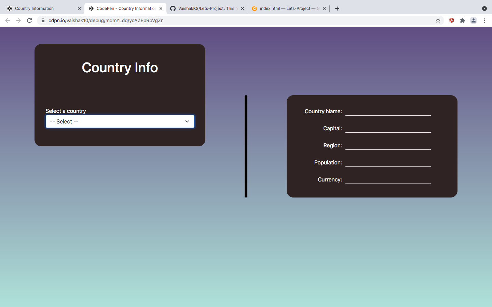
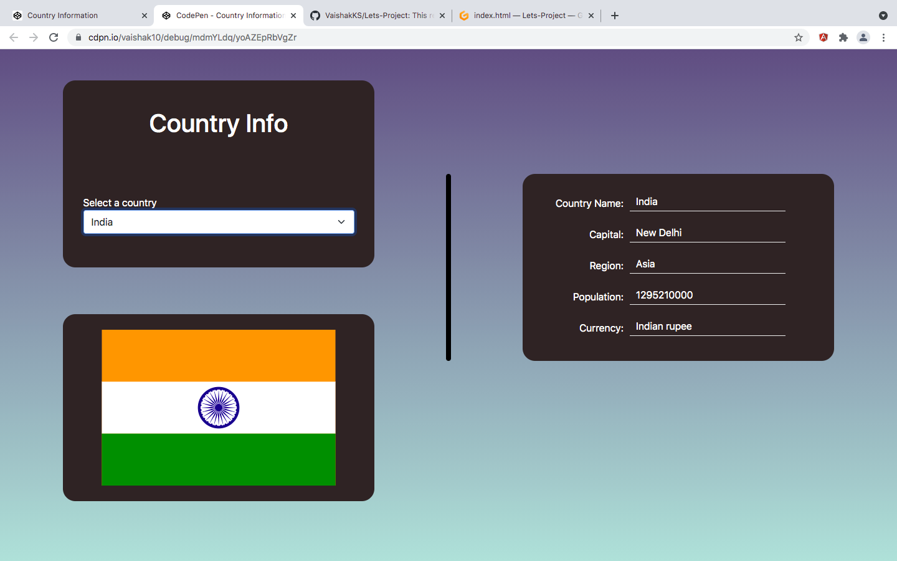

# Country Infos

## What It Does?

This is a simple single page application that lists basic details of a particluar country.

The details include: 
- Country Name
- Capital
- Region
- Population
- Currency

When a country name is selected , along with the basic information the counrty's flag too is displayed.

Take a look at [link](abc) and give it a try.

## Snapshots

## Technologies used

- HTML
- CSS
- Bootstrap
- Javascript

## Credits

A big shoutout to [restcountries](https://restcountries.eu/) for API's required to fetch country details.

