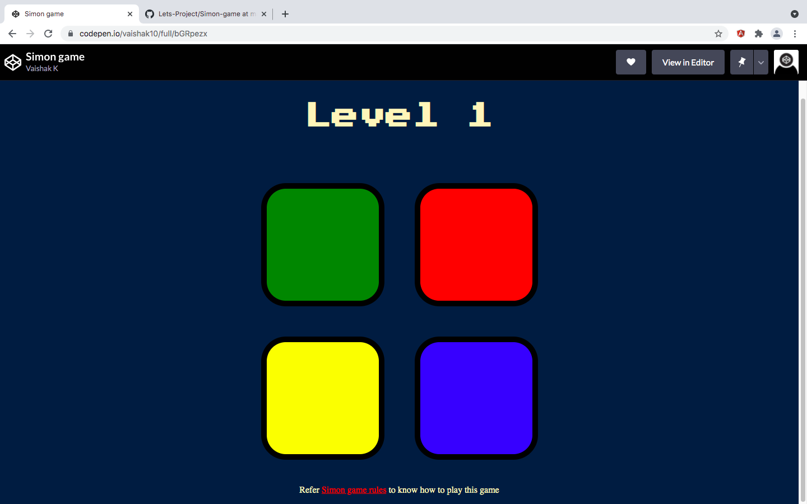

# Simon game

The object of the game: **Correctly repeat a longer and longer sequence of signals.**

For more details on how to play this game refer [simon-game-rules](https://www.ultraboardgames.com/simon/game-rules.php)

Simon game implementation url: [Simon-game](https://codepen.io/vaishak10/full/bGRpezx)

## Snapshots

## Technologies used
- HTML
- CSS
- Javascript
- Jquery

## What I learned
Have worked with lot of DOM manipulating methods ,but this time wanted to implement DOM manipulation using JQuery Api's which reduces code length. Some of the Jquery api's used in this project are:
1. `text()`
2. `addClass()`
3. `removeClass`
4. `fadeIn()`
5. `fadeOut()`
6. `attr()`
7. `click()`
8. `keypress()`

JQuery documentation to know more in depth about these api's and many other's:  
1. [Jquery-api-docs](https://api.jquery.com/) 
2. [w3schools-Jquery](https://www.w3schools.com/jquERy/default.asp)

## Credits
This game is a project based on one of the modules of `The Complete Web Development Bootcamp` by Angela Yu. 
